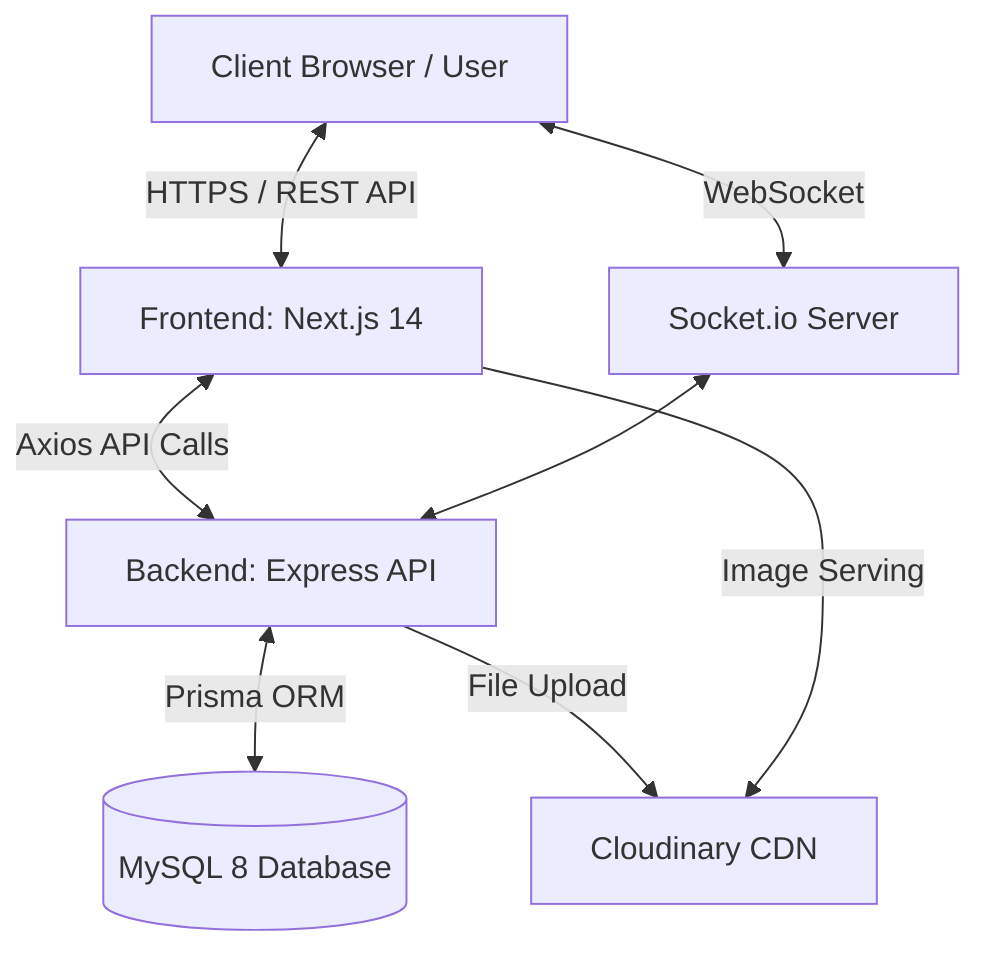
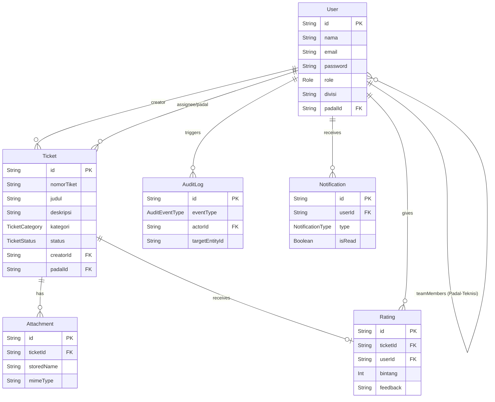
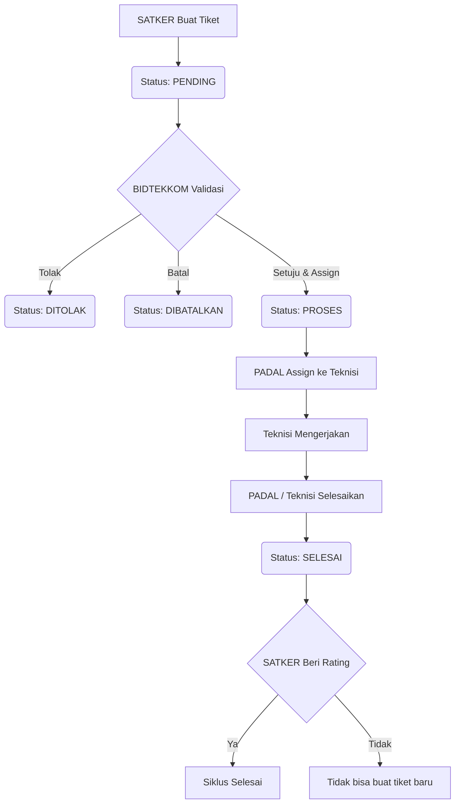

  # LAPORAN PROJECT: SIGAP (Sistem Informasi Gangguan dan Aduan Polri)

## BAB I - PENDAHULUAN

### 1.1 Latar Belakang
[PERLU DIISI MANUAL - Latar belakang instansi, permasalahan nyata di Polda Kalimantan Selatan yang memicu pembuatan sistem ini]. 
Dari segi teknis, sistem helpdesk IT internal di instansi seringkali masih menggunakan pencatatan manual atau alur komunikasi yang tidak terstruktur. Hal ini mengakibatkan sulitnya melacak status penyelesaian gangguan TI, tidak adanya standar Service Level Agreement (SLA) yang jelas, dan kurangnya transparansi dalam penugasan teknisi. Oleh karena itu, dikembangkan SIGAP (Sistem Informasi Gangguan dan Aduan Polri), sebuah sistem helpdesk IT internal berbasis web yang dikhususkan untuk satuan kerja di lingkungan kepolisian. Sistem ini mendigitalisasi alur pelaporan tiket dari awal hingga selesai secara real-time, terstruktur, dan transparan.

### 1.2 Rumusan Masalah
1. Bagaimana merancang dan membangun sistem helpdesk IT yang dapat mencatat, melacak, dan mengelola gangguan TI secara terpusat?
2. Bagaimana mengimplementasikan sistem pembagian hak akses (Role-Based Access Control) untuk memisahkan fungsi pelapor (SATKER), verifikator (BIDTEKKOM), pengawas (PADAL), dan pelaksana (TEKNISI)?
3. Bagaimana mengintegrasikan fitur komunikasi dan notifikasi *real-time* agar status penyelesaian gangguan dapat dipantau langsung oleh pelapor?
4. Bagaimana mengelola mekanisme penilaian (rating) untuk mengevaluasi kinerja teknisi secara wajib sebelum pelapor dapat mengajukan gangguan baru?

### 1.3 Tujuan & Manfaat
**Tujuan:**
- Membangun aplikasi web helpdesk IT (SIGAP) untuk digitalisasi pelaporan gangguan TI.
- Mengimplementasikan alur penyelesaian tiket dengan struktur *Role-Based Access Control* (RBAC) yang spesifik.
- Menyediakan *audit trail* dan laporan bulanan untuk evaluasi kinerja operasional IT.

**Manfaat:**
- [PERLU DIISI MANUAL - Manfaat spesifik bagi institusi Polda Kalsel].
- Mengurangi waktu tanggap (*response time*) dan kebingungan birokrasi dalam penanganan gangguan TI.
- Memberikan transparansi status perbaikan kepada Satuan Kerja (SATKER).

### 1.4 Batasan Masalah
- Sistem berbasis web (diakses via peramban), tidak menyediakan aplikasi *native mobile*.
- Alur kerja hanya mencakup 4 peran utama: SATKER, BIDTEKKOM, PADAL, dan TEKNISI.
- Sistem tidak menangani inventarisasi *hardware* (Asset Management) secara detail, melainkan hanya pelaporan insiden/gangguan.
- Notifikasi *real-time* dibangun di atas WebSocket (Socket.io) dan di dalam aplikasi web (in-app notification), belum mencakup integrasi notifikasi pihak ketiga seperti WhatsApp Gateway (meskipun ada field nomor WhatsApp di database).

---

## BAB II - LANDASAN TEORI

### 2.1 Next.js (App Router)
Next.js adalah framework React yang memungkinkan pembuatan aplikasi web fungsional penuh dengan *Server-Side Rendering* (SSR) dan *Static Site Generation* (SSG). Pada project ini, Next.js versi 14 digunakan dengan arsitektur App Router, yang memungkinkan *routing* berbasis direktori, pemisahan *Server Components* dan *Client Components*, serta pengambilan data yang lebih efisien.

### 2.2 Express.js
Express.js adalah kerangka kerja aplikasi web fleksibel untuk Node.js yang menyediakan serangkaian fitur tangguh untuk aplikasi web dan seluler. Dalam sistem SIGAP, Express (v4.18) berperan sebagai *backend* API (RESTful API), menangani logika bisnis, autentikasi, serta berinteraksi dengan database.

### 2.3 Prisma ORM dan MySQL
Prisma adalah *Object-Relational Mapper* (ORM) modern untuk Node.js dan TypeScript yang menyederhanakan akses database, migrasi, dan manajemen skema. Prisma menggunakan file `schema.prisma` sebagai sumber kebenaran tunggal (*single source of truth*). Database relasional yang digunakan adalah MySQL versi 8, dipilih karena keandalan dan skalabilitasnya dalam menyimpan data terstruktur seperti tiket, pengguna, dan *audit log*.

### 2.4 WebSocket dan Socket.io
WebSocket adalah protokol komunikasi komputer yang menyediakan saluran komunikasi dua arah secara penuh melalui koneksi TCP tunggal. Socket.io (v4.7) adalah pustaka berbasis WebSocket yang digunakan pada SIGAP untuk memberikan pembaruan status tiket dan notifikasi baru secara *real-time* ke klien tanpa perlu *refresh* peramban.

### 2.5 Role-Based Access Control (RBAC)
RBAC adalah metode pembatasan akses sistem kepada pengguna yang berwenang. Pada sistem manajemen tiket TI ini, RBAC diimplementasikan secara ketat menjadi 4 lapis:
1. **SATKER**: Satuan Kerja, pihak yang mengalami gangguan dan melaporkan tiket.
2. **BIDTEKKOM**: Verifikator pusat yang menilai validitas tiket sebelum disalurkan.
3. **PADAL**: Perwira Pengendali, supervisor yang mengelola tim teknisi dan mendelegasikan tiket.
4. **TEKNISI**: Pelaksana lapangan yang memperbaiki gangguan.

---

## BAB III - ANALISIS DAN PERANCANGAN SISTEM

### 3.1 Analisis Kebutuhan
**Kebutuhan Fungsional:**
- Sistem harus dapat memfasilitasi pembuatan tiket baru dengan lampiran *file*.
- Sistem harus mewajibkan pengguna (SATKER) untuk memberi penilaian pada tiket yang sudah selesai sebelum bisa membuat tiket baru.
- Sistem harus membatasi akses baca dan tulis sesuai peran (contoh: SATKER hanya melihat tiketnya sendiri, TEKNISI hanya tiket yang ditugaskan kepadanya).
- Sistem harus mencatat jejak audit (*audit log*) secara otomatis pada setiap perubahan status tiket.

**Kebutuhan Non-Fungsional:**
- Sistem harus responsif untuk diakses via desktop dan perangkat seluler (Tailwind CSS).
- Notifikasi dan perubahan status harus muncul secara instan (*real-time* via Socket.io).
- Sistem harus aman dari manipulasi status dengan menggunakan pengecekan berbasis otoritas token JWT.

### 3.2 Diagram Arsitektur Sistem



### 3.3 Entity Relationship Diagram (ERD)



### 3.4 Flowchart Alur Tiket



### 3.5 Rancangan Antarmuka
Antarmuka dibangun dengan shadcn/ui dan Tailwind CSS, menggunakan pendekatan *Role-Based Layout*:
- **Halaman Login**: Formulir sederhana dengan email dan password.
- **Dashboard SATKER**: Menampilkan ringkasan (Pending, Proses, Selesai), *banner* merah peringatan jika ada tiket selesai yang belum di-rating, dan tabel tiket terbaru.
- **Dashboard BIDTEKKOM**: Menampilkan semua metrik sistem secara global, daftar tiket yang butuh *assign*, serta navigasi ke manajemen staf dan log audit.
- **Halaman Detail Tiket**: Menampilkan lini masa status, deskripsi, lampiran gambar, dan tombol aksi yang berubah dinamis sesuai peran pengguna saat itu.

---

## BAB IV - IMPLEMENTASI SISTEM

### 4.1 Spesifikasi Teknologi (Tech Stack)
- **Frontend**: Next.js (14.2.0), React (18.2.0), Tailwind CSS (3.4.1), Zustand/React Query (v5.28.0), Socket.io Client (4.7.4).
- **Backend**: Express (4.18.2), Prisma ORM (5.10.0), MySQL (8.0), Socket.io (4.7.4), JWT, bcryptjs, Zod.
- **Infrastruktur**: Vercel (Frontend), Railway (Backend & Database MySQL).
- **Layanan Pihak Ketiga**: Cloudinary (Penyimpanan File/Gambar), Nodemailer (Reset Password).

### 4.2 Struktur Direktori Utama
Proyek ini menggunakan arsitektur *Monorepo* dengan *NPM Workspaces*:
- `/frontend`: Seluruh *client-side logic* dan komponen UI (Next.js App Router).
- `/backend`: REST API Server, konfigurasi Socket, logika autentikasi, layanan (*services*), dan Prisma ORM.
- `/shared`: Tipe TypeScript (`types.ts`) dan konstanta yang dipakai bersama antara frontend dan backend untuk mencegah asinkronisasi tipe.

### 4.3 Implementasi Fitur Utama (Code Highlight)

**1. Validasi Pembuatan Tiket dan Pengecekan Rating Wajib (`backend/src/services/ticketService.ts`)**
Sistem mewajibkan pengguna Satker melengkapi divisi dan mencegah pembuatan tiket jika ada tiket `SELESAI` yang belum diulas.

```typescript
// Pengecekan divisi
if (!user.divisi) {
  throw new AppError(400, 'DIVISI_REQUIRED', 'Silakan lengkapi divisi di profil Anda terlebih dahulu');
}

// Pengecekan tiket selesai yang belum di-rating
const unratedCount = await prisma.ticket.count({
  where: {
    creatorId: userId,
    status: 'SELESAI',
    rating: null,
  },
});

if (unratedCount > 0) {
  throw new AppError(400, 'UNRATED_TICKETS_EXIST', 'Anda memiliki tiket selesai yang belum diberi rating');
}
```

**2. Dynamic Dashboard Rendering (`frontend/src/app/(dashboard)/dashboard/page.tsx`)**
Frontend merender komponen secara kondisional tergantung peran (Role) yang dikembalikan oleh API Autentikasi.

```tsx
export default function DashboardPage() {
  const { user, isLoading } = useAuth();
  
  if (!user) return null;

  return (
    <div className="space-y-6 p-6">
      {/* Dynamic routing rendering component based on role */}
      {user.role === "SATKER" && <SatkerDashboard />}
      {user.role === "BIDTEKKOM" && <BidtekkomDashboard />}
      {user.role === "PADAL" && <PadalDashboard />}
      {user.role === "TEKNISI" && <TeknisiDashboard />}
    </div>
  );
}
```

### 4.4 Implementasi Keamanan & Optimasi
- **Optimistic Locking**: Digunakan saat assign tiket ke PADAL untuk menghindari kondisi balapan (*race condition*) jika dua admin mencoba menugaskan tiket yang sama secara bersamaan. Dilakukan dengan *updateMany* yang memfilter status awal.
- **Autentikasi & Otorisasi JWT**: Middleware `authenticate.ts` dan `authorize.ts` memastikan hanya token sah yang belum dihapus secara logika (*soft delete*) yang dapat berinteraksi.
- **Validasi Permintaan (Zod)**: Semua muatan permintaan divalidasi ketat dengan pustaka Zod sebelum diproses di lapis layanan.

---

## BAB V - PENGUJIAN

### 5.1 Metode Pengujian
Aplikasi diuji menggunakan *Jest* pada backend, dengan dua lapis pengujian:
1. **Property-Based Testing** menggunakan *fast-check* untuk memvalidasi invarian sistem (contoh: pembuatan token JWT, *hashing* yang tidak dapat dibalik, batas unik pembuatan nomor tiket).
2. **Unit & Integration Tests** untuk memverifikasi logika bisnis pada lapis layanan (contoh: verifikasi alur *assign* tiket yang menolak permintaan jika status bukan *PENDING*).

### 5.2 Skenario Pengujian Fungsional (Disarankan)
*[Hasil aktual perlu divalidasi secara manual/live]*

| No | Skenario | Input / Aksi | Expected Output | Actual Output | Status |
|----|----------|--------------|-----------------|---------------|--------|
| 1 | Pembuatan Tiket Tanpa Divisi | SATKER daftar baru, langsung buat tiket | Sistem menolak dengan error `DIVISI_REQUIRED` | [PERLU DIISI MANUAL] | [PERLU DIISI MANUAL] |
| 2 | Pembuatan Tiket dengan *Blocker* Rating | SATKER punya tiket status SELESAI tanpa rating, lalu submit form tiket baru | Sistem menolak dengan error `UNRATED_TICKETS_EXIST` | [PERLU DIISI MANUAL] | [PERLU DIISI MANUAL] |
| 3 | Akses Lintas Peran (*Data Scoping*) | SATKER mencoba memanggil endpoint tiket milik pengguna lain via cURL API | Ditolak oleh server (HTTP 403 Forbidden) | [PERLU DIISI MANUAL] | [PERLU DIISI MANUAL] |
| 4 | Pembaruan Real-Time | BIDTEKKOM ubah status tiket jadi PROSES | Halaman dashboard SATKER memunculkan toast/notif tanpa reload | [PERLU DIISI MANUAL] | [PERLU DIISI MANUAL] |

---

## BAB VI - HASIL DAN PEMBAHASAN

### 6.1 Ringkasan Hasil
Sistem SIGAP telah berhasil diimplementasikan sebagai *monorepo* Next.js dan Express, mengotomatisasi alur birokrasi penanganan insiden TI. Keempat peran sistem (SATKER, BIDTEKKOM, PADAL, TEKNISI) telah berfungsi sesuai dengan *scope* masing-masing, ditandai dengan filter basis data di tingkat kueri Prisma dan perisai UI pada frontend.

### 6.2 Kelebihan Sistem
- **Keamanan Kuat**: Arsitektur memisahkan logika validasi di backend secara mandiri dari UI.
- **Komunikasi Real-Time**: Integrasi Socket.io meningkatkan kepuasan pengguna karena transparansi *live update* layaknya sistem pelacakan modern.
- **Konsistensi Kode**: Penggunaan *Shared Types* TypeScript pada *monorepo* mencegah kesalahan struktur data antara klien dan server.

### 6.3 Kekurangan & Keterbatasan
- Pengiriman notifikasi masih mengandalkan koneksi aktif soket dan/atau in-app notification; tidak ada notifikasi *push* eksternal via SMS/WhatsApp yang bisa dibaca saat pengguna menutup sistem.
- Penghapusan data masih dilakukan secara logika (*soft delete*) yang aman untuk audit, namun belum ada mekanisme *cron job* untuk pembersihan basis data berjangka waktu lama (*data archiving*).
- Gambar yang diunggah ke Cloudinary bergantung pada kestabilan penyedia pihak ketiga tersebut.

### 6.4 Saran Pengembangan
1. **Integrasi WhatsApp API**: Mengingat nomor WhatsApp tersimpan di database, integrasi ke Gateway WA dapat memastikan pelapor segera diinformasikan saat tiketnya ditangani, meskipun mereka *offline*.
2. **Dashboard Analitik**: Penambahan grafik tren gangguan (kategori terbanyak, *response time* rata-rata per bulan) dapat membantu jajaran manajerial merencanakan pengadaan/perawatan perangkat.
3. **PWA (Progressive Web App)**: Menerapkan fungsionalitas PWA agar teknisi di lapangan bisa mengakses dan mengupdate tiket lebih mudah layaknya aplikasi seluler lokal.
